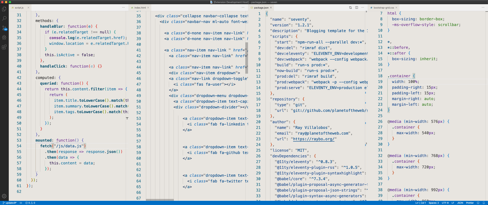

# Raybo Light

A simple, easy to use Visual Studio Code Color Theme. Light, but with a gray/beige background, darker colors with good contrast. My goal is to use this when recording tutorials, so I don't want distracting or wild colors. Definitely a work in progress.

## Installation

- Open the Extensions sidebar in VS Code. View → Extensions
- Search for raybo, choose "raybo-light"
- Click Install to install it
- Click Reload to reload your editor
- Navigate to File > Preferences > Color Theme > Raybo Light

## Contributing

Please report bugs or issues [here](https://github.com/planetoftheweb/raybo-light-vscode).

## License

This theme is released under the MIT License.
